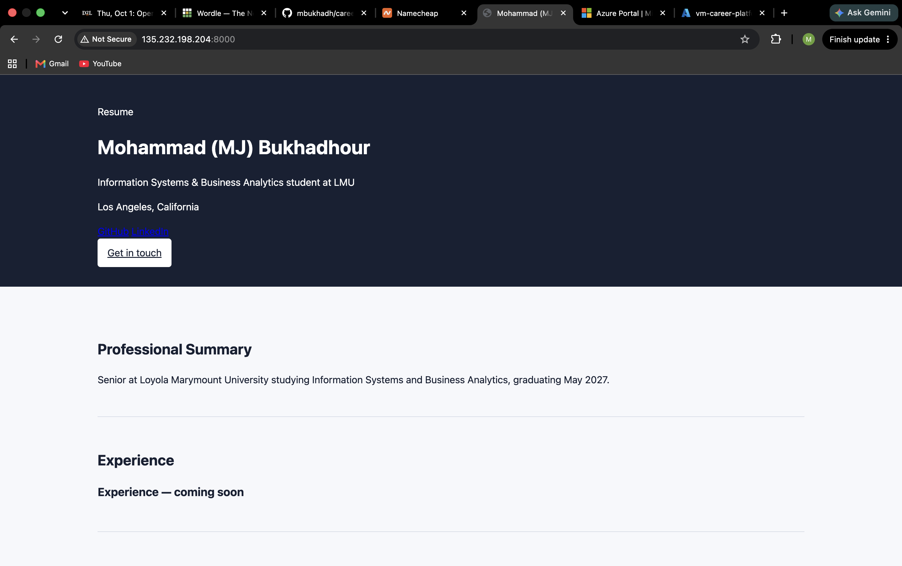

# Exercise 03 evidence: build it, then move it

## 1. The VM

| | |
| --- | --- |
| VM name | `vm-career-platform` |
| Resource group | `rg-career-platform` |
| Region | North Central US |
| Size | `Standard_B2ats_v2` (2 vCPUs, 1 GiB) |
| Image | Ubuntu Server 24.04 LTS, x64 Gen2 |
| Public IP | `135.232.198.204` |

The migration plan with every step's result is in
[`docs/superpowers/plans/2026-09-24-azure-vm-migration.md`](../superpowers/plans/2026-09-24-azure-vm-migration.md).

## 2. The site on the VM

My site served from the VM at `http://135.232.198.204:8000`, taken while the
`Temp-HTTP-8000` rule was open:

## 3. What went wrong, and how I found it

**The database I was supposed to migrate didn't exist.** When I went to
download `career_platform.db` from my Codespace, it wasn't there. I searched
the whole Codespace filesystem for `*.db` and `*.sqlite*` files and found only
files belonging to VS Code, Copilot, and the man-page cache. The `.worktrees/`
folder was empty, with a timestamp of Sep 24, right after I merged my feature
branch. The app had created its database inside that worktree, and because
`*.db` is in `.gitignore`, removing the worktree deleted the only copy. Git
never had it, by design.

My profile content lives in `app/seed.py`, so I followed the guide's fallback:
the VM built its database with `alembic upgrade head` and `python -m app.seed`.
What confirmed it: `PRAGMA integrity_check` returned `ok`, and the `profiles`
table held my published profile. That was **seed data, not migrated data**.

**Update, 10/6: the data step is now a real copy.** The Codespace original
can't be recovered, so I recreated the database on my laptop with
`alembic upgrade head` and `python -m app.seed`, checked that the app served
my profile from it, and copied the file to the VM with `scp`, to the path the
VM's `.env` names. What confirmed it:

| Check | Laptop | VM |
| --- | --- | --- |
| SHA-256 of `career_platform.db` | `f92f507a…f760cd` | `f92f507a…f760cd` |
| `PRAGMA integrity_check` | `ok` | `ok` |
| Profile row created | 10/6 21:42 UTC | 10/6 21:42 UTC |
| `/healthz` | `{"status":"ok"}` | `{"status":"ok"}` |
| Home page heading | my name | my name |

The matching checksum and the laptop's created-at time on the VM's row show
the file was copied, not reseeded on the VM. The content is still what
`app/seed.py` writes, so this proves the copy path works, not that last
month's Codespace data survived.

One thing went wrong in the copy. The plan was to stop the service, back up
the VM's database, then copy. A quoting error made the stop and backup
commands fail, and the `scp` ran anyway, so the VM's old file was overwritten
with no backup while the service was running. Nothing unique was lost, since
that file was the same seed content, and I restarted the service right after.
On a database with real data, that order would have cost me the rollback.

**Other things that differed from the guide:**

- The VM is in North Central US on `Standard_B2ats_v2` (the AMD version of the
  size) instead of West US 2 on `Standard_B2ts_v2`. Both run the same Ubuntu
  24.04 x64 image.
- When I came back to the VM, it was deallocated. Nothing was lost, since the
  disk keeps everything, and `az vm start` brought it back with the same
  public IP.
- My repository had no `uv.lock`. I created it on my laptop, ran the test
  suite against the locked versions (12 passed), and pushed it before the VM
  cloned the code, so the VM installed what I had tested.
- On 10/1 I was on a different network, so my laptop's public address no
  longer matched the SSH rule. I changed the rule's source to my new `/32`
  instead of widening it to Any.
- The app's health check is `/healthz`, not `/health` as in the guide.

## 4. The change

> You're at a coffee shop and try to SSH into your VM to fix a typo. The
> command hangs.

My SSH rule only allows my old IP address, so when I changed networks, SSH
hung. I'd run `az network nsg rule update` to change the rule's source to my
new IP. It costs a minute each time I change networks, and I never open SSH to
Any, so security stays tight.
